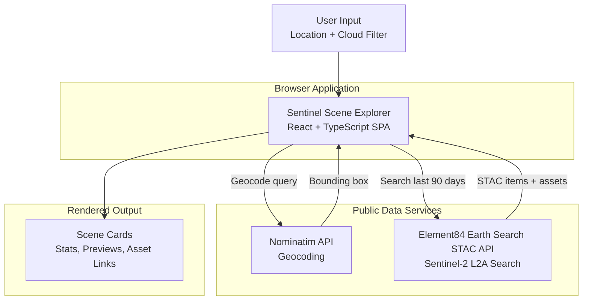

# Sentinel Scene Explorer

**Search recent Sentinel-2 satellite scenes by location, entirely in the browser.**

Geocode any place name with OpenStreetMap Nominatim, query the free Element84 Earth Search STAC API, and explore recent low-cloud Sentinel-2 L2A scenes with preview imagery, summary stats, and direct asset links.

[Live Demo](https://alok-19.github.io/sentinel-scene-explorer/) • [Repository](https://github.com/alok-19/sentinel-scene-explorer) • [Report an Issue](https://github.com/alok-19/sentinel-scene-explorer/issues)


---

## Overview

Sentinel Scene Explorer is a lightweight geospatial discovery tool for anyone who wants a fast way to inspect recent satellite scenes without signing up for a platform, configuring a GIS stack, or running backend infrastructure.

You type a location like `Tokyo Japan` or `Zambia`, and the app:

1. geocodes the place name into a bounding box
2. searches recent Sentinel-2 L2A scenes from the last 90 days
3. filters results by cloud cover
4. returns browsable scene cards with preview imagery and direct data links

## Why use it

- **No backend required**: everything runs in the browser
- **No API keys required**: built on top of public APIs
- **Fast to understand**: search by place name instead of GIS coordinates
- **Useful output**: scene previews, cloud cover, acquisition time, bounding boxes, and direct asset access
- **Easy to deploy**: static hosting on GitHub Pages

## Features

- Location search powered by OpenStreetMap Nominatim
- Scene search powered by Element84 Earth Search STAC
- Last 90 days filter for more relevant imagery
- Adjustable cloud cover threshold
- Summary stats for scene count, average cloud cover, and date range
- Responsive dark interface optimized for desktop and mobile
- Graceful loading, empty, and failure states
- 10-second timeout protection for external requests
- Direct links to STAC items and selected raster/data assets

## How it works



## Stack

- **Frontend**: React, TypeScript, Vite
- **Styling**: Tailwind CSS
- **Data APIs**: Nominatim, Element84 Earth Search STAC
- **Hosting**: GitHub Pages
- **CI/CD**: GitHub Actions

## Quick Start

```bash
git clone https://github.com/alok-19/sentinel-scene-explorer.git
cd sentinel-scene-explorer
npm install
npm run dev
```

Local app URL:

```text
http://localhost:5173
```

## Production Build

```bash
npm run build
```

Build output is written to `dist/`.

## Deployment

This repository is configured for GitHub Pages with GitHub Actions.

Deployment flow:

1. Push to `main`
2. GitHub Actions installs dependencies and builds the app
3. The generated `dist/` bundle is published to GitHub Pages

Live site:

```text
https://alok-19.github.io/sentinel-scene-explorer/
```

## Project Structure

```text
src/
  App.tsx        Main UI, request flow, state handling, and result rendering
  main.tsx       React entry point
  index.css      Tailwind imports and global theme styles

.github/workflows/
  deploy.yml     GitHub Pages deployment workflow
```

## Production Notes

- Typed request and response models keep API integration predictable
- Network requests are timeout-protected and return clearer user-facing failures
- Search responses are guarded against stale request overwrites
- STAC asset selection is heuristic so preview and data links work across varying item shapes
- Vite is configured for static subpath deployment, which keeps GitHub Pages hosting simple

## Known Constraints

- The app depends on public third-party APIs, especially Nominatim, which may rate-limit anonymous traffic
- STAC assets are not perfectly standardized across all items, so the chosen preview/data asset is a best-effort selection
- There is no backend proxy, caching layer, or server-side retry strategy in this architecture

## Example Searches

- `Tokyo Japan`
- `Zambia`
- `Nairobi Kenya`
- `Santiago Chile`
- `California USA`

## Roadmap

- Map-based bounding box selection
- Client-side caching for repeated searches
- Sorting and date-range controls
- Scene detail drawer with richer metadata
- Saved searches and lightweight history

## License

This project is open source and intended for practical use, experimentation, and extension.
